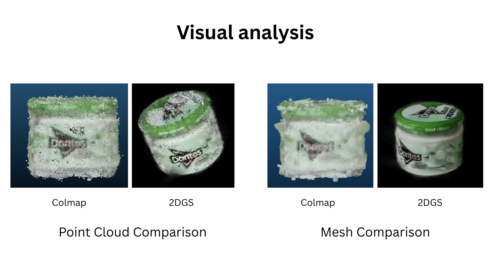
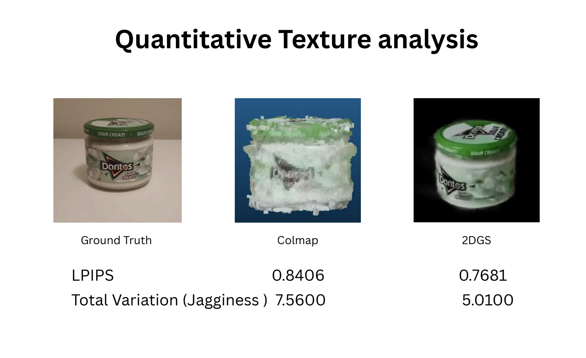
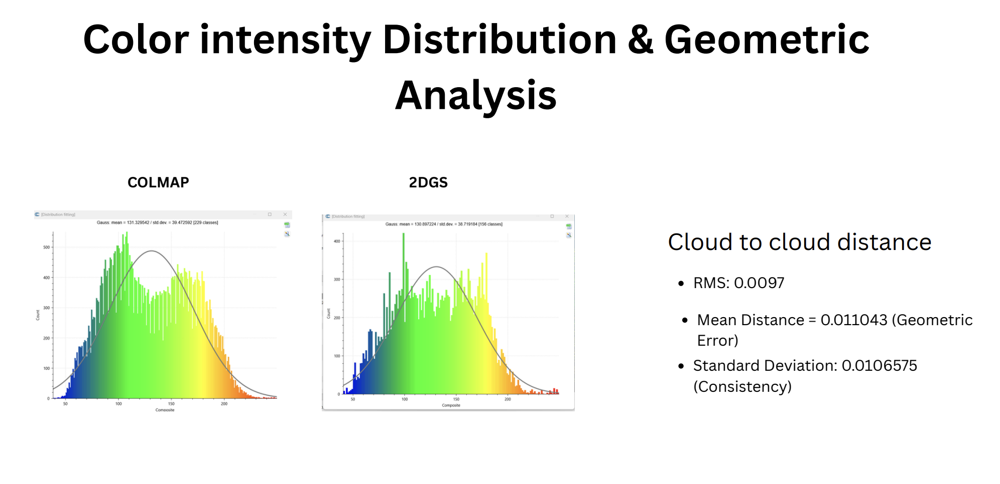

# Hybrid-3D-Reconstruction-from-2D-image-Classical-3DGS-2DGS-
## 📄 Paper

📥 [Read the Paper](./Hybrid%203D%20Reconstruction_%20Combining%20Classical%20and%20Learning-Based%20Approaches.pdf)

In this work we developed 3D reconstruction from 2D images with improved texture and relighted 3d Models. 
To implement this project You already need to run your 3d recontruction from 2D image in COLMAP. So that you can use the same gerometry as ground truth but with better texture and relighted 3D model. 
After reconstruction in COLMAP, use the generated images and sparse folder generated by COLMAP for running 2D_Gaussian_Splatting.ipynb or 3D_Gaussian_Splatting. 
The 3DGS will develop the texture of the 3D model as blob. 
The 2DGS will develop the texture of the 3D model as Elipsoids. 
To improve your model lighting, you can use the 3D relighting.py folder. 

We have uploaded our Splat/ ply/ Sparse file extracted from our dataset as demo for your imeplementation reference. 

Final Demo on Splat Editor: 

Our pipeline:

3DGS Results:

2DGS Results:

Qualitative Analysis

Quantitative Analysis

